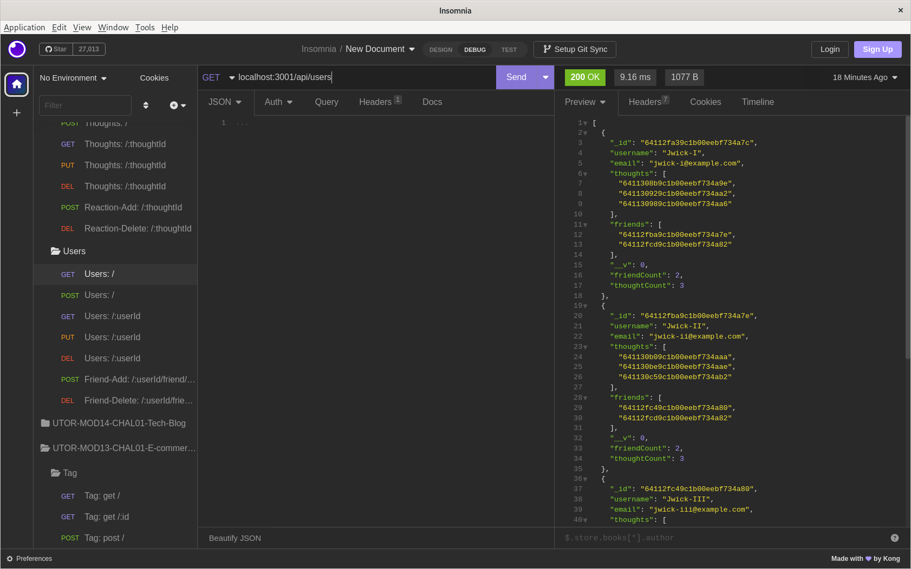
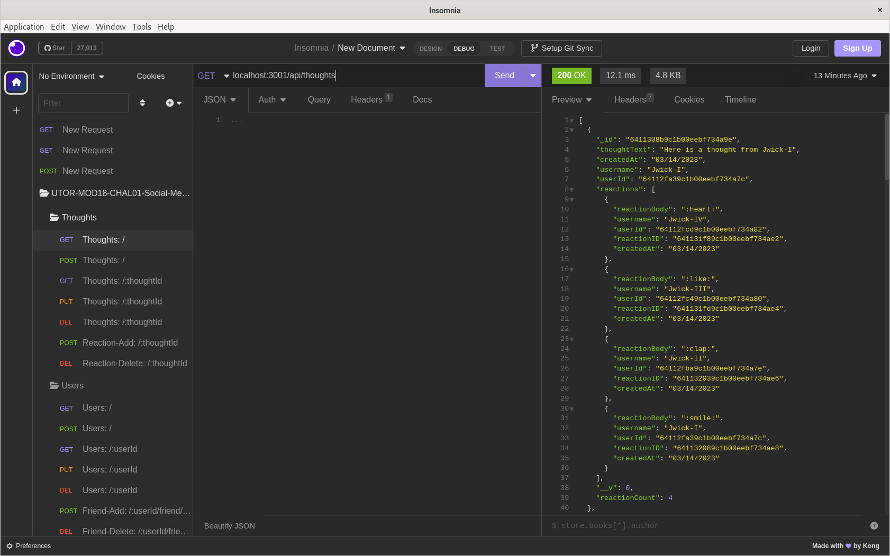

# UTOR-MOD18-CHAL01-Social-Media-App
University of Toronto - Module 18 - Challenge 01 - Social Media Application

## Description

Repository containing the code for the Social Media application. This is a back-end application (for now) that creates the backbone of a social media app:
- creation of a user
- adding/removing friends
- deleting user
- thought sharing by users
- adding/removing reactions to thoughts. 

The application makes extensive use of MongoDB for storage and all interactions between the front end (in our case Insomnia) and the back end is done through mongoose. 

The video walkthrough (https://youtu.be/a2QWuBZ1OFU) provides details on the usage and functionality of the Application. 

Below is the image of Insomnia when a user gets all Users.


Below is the image of Insomnia when the user gets all Thoughts.



## Table of Contents

- [Installation](#installation)
- [Functionality](#functionality)
- [Usage](#usage)
- [Credits](#credits)
- [Tests](#tests)
- [License](#license)
- [Walktrough](#walkthrough)
- [Future Development](#future-development)

## Installation

PRE-Requisites: 
- you must have node.js version 16.* installed on your computer prior to proceeding


### Application launch:
1. Download the source code
2. Navigate to the folder containing the package.json file
3. Run the following commands
```md
        $ npm install
        $ npm start
```


back to [Table of Contents](#table-of-contents)


## Functionality

The following discusses at a high level about some of the features of the website. Detailed code implementation can be found as comments in the JS files.


### MongoDB:

MongoDB is document-oriented database that can handle large sets of unstructred data. The porject is built using MongoDB for the data storage. In addition, dotenv was used to hide the connection string that may or may not contain any user or passwords.

### Mongoose:

Mongoose is the library that is being used to effectively communicate with MongoDB. It is used for creating the various schemas and models as well as running all queries. Several validation features are being used such as length or post and reactions, as well as virtuals to show some quick aggregates.

back to [Table of Contents](#table-of-contents)

## Usage

1. Launch the applicaiton
2. Use Insomnia to navigate to the various routes:
```md
USERS
    GET:    \api\users  (listing of all users)
    POST:   \api\users  (create a new user)
    GET:    \api\users\:userID  (list specific user)
    PUT:    \api\users\:userID  (update specific user)
    DELETE: \api\users\:userID  (delete specific user)
    POST:   \api\users\:userID\firends\:friendID (add friend to user)
    DELETE: \api\users\:userID\firends\:friendID (remove friend from user)

THOUGHTS
    GET:    \api\thoughts  (listing of all thoughts)
    POST:   \api\thoughts  (create a new thoughts)
    GET:    \api\thoughts\:thoughtsID  (list specific thought)
    PUT:    \api\thoughts\:thoughtsID  (update specific thought)
    DELETE: \api\thoughts\:thoughtsID  (delete specific thought)
    POST:   \api\thoughts\:thoughtsID\reactions\:reactionID (add reaction to thoughts)
    DELETE: \api\thoughts\:thoughtsID\reactions\:reactionID (remove reaction from thoughts)
```

back to [Table of Contents](#table-of-contents)


## Credits
n/a

back to [Table of Contents](#table-of-contents)


## Tests

All tests have been performed manually using Insomnia.

back to [Table of Contents](#table-of-contents)


## License

Please refer to the LICENSE in the repo.

back to [Table of Contents](#table-of-contents)


## Walkthrough

The walkthrough is located here: https://youtu.be/a2QWuBZ1OFU.

back to [Table of Contents](#table-of-contents)


## Future Development

Here are some of the items to be considered for future development.
1. Friend reciprocity: this means that when user A adds user B as a friend, then in additon to user A having user B in user A's friends list, user B has user A automatically added in user B's list.
2. Reaction removal: when user is deleted, currently, the user and the user's thoughts are deleted; however reactions from that user are still in the database. This can be an enhancement to also have the reactions removed.

back to [Table of Contents](#table-of-contents)
